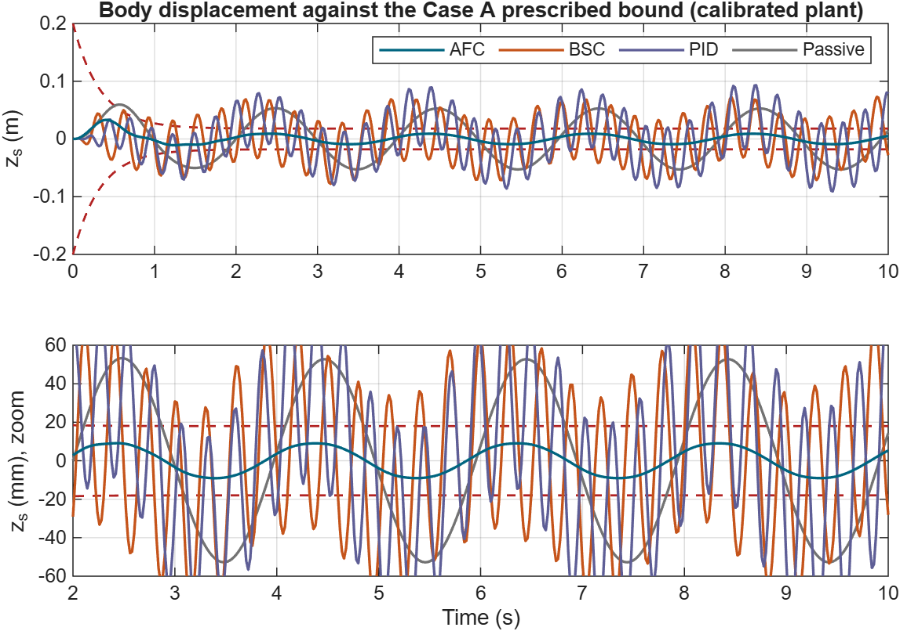
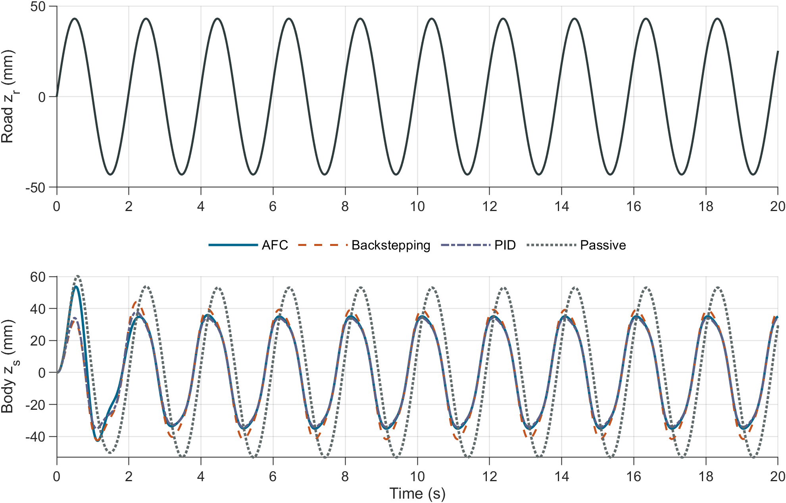

# Quarter-car active suspension: AFC paper reproduction

**Source paper:** J. Na et al., ["Active Suspension Control of Quarter-Car System With Experimental Validation"](https://doi.org/10.1109/TSMC.2021.3103807), *IEEE Transactions on Systems, Man, and Cybernetics: Systems*, 52(8), 4714-4726, 2022 ([IEEE Xplore](https://ieeexplore.ieee.org/document/9530282)). In this project **AFC means approximation-free control**; **PPF means prescribed performance function**.

**Status (October 2026):** an Advanced Control Theory course project, simulation only. The **v2 study** is the current one. On a literature hydraulic quarter car calibrated to one paper experiment, it reproduces the paper's Case-10 AFC result within 7%. It then tests the paper's claims with control-theoretic analysis, fair comparators, robustness and transient studies, and an anti-windup extension. All figures and numbers come from a MATLAB R2026a run that takes about four minutes. The v1 baseline is kept unchanged [below](#v1-baseline).



> **Evidence boundary:** paper-reported measurements and our simulations are different evidence. Every number in the v2 report is tagged as *Paper*, *Approx.* (read off a paper plot), *Calibrated*, *Assumed* or *Sim*. The paper does not publish its rig's pressure scaling, valve gain or lag, so the comparison is at the level of trends, not digits.

## Deliverables

| File | What it is |
| --- | --- |
| [Report v2](deliverables/QuarterCar_AFC_Report_v2.pdf) | 10-page study: method, calibration, hold-out, theory audit, comparators, extensions, verdicts on each claim |
| [Slides v2](deliverables/QuarterCar_AFC_Presentation_v2.pdf) | 19-slide talk, with [speaker notes](Presentation_Notes_v2.md) |
| [`README_v2.md`](README_v2.md) | v2 run guide, findings and file layout |
| [Web lab](web/quarter_car_afc_lab.html) | interactive simulator running the same equations in the browser (open the file) |
| [`cad/`](cad/), [`animation/`](animation/) | FreeCAD rig (STEP/STL) and Blender animations driven by simulated trajectories |
| v1 [report](deliverables/QuarterCar_AFC_Research_Report.pdf) and [slides](deliverables/QuarterCar_AFC_Presentation.pdf) | the first-stage study, kept for reference |

## Main findings (v2)

1. **v1 failure, correctly attributed.** On the v1 plant, the paper's Case-A gains make the 50 Hz loop locally unstable (spectral radius 1.02). Removing the ±5 V rail makes things worse, so saturation was a symptom rather than the cause.
2. **Calibrated reproduction.** On the Alleyne–Hedrick hydraulic quarter car with the paper's servo-valve law, two fitted factors suffice: valve gain 5e-4 m/V and a lumped lag of 33 ms. The paper's *unchanged* AFC then gives IAE 0.129, ITAE 1.20 and ITSE 0.0088, against the paper's 0.122, 1.14 and 0.0093, with about 0.5 V RMS command. BSC and PID saturate, as in the paper.
3. **Identifiability.** The paper's Case-B gains fail a hold-out test. A joint fit to both gain sets gives a train error of 0.22 but a test error of 0.63.
4. **Theory.** Lemma 1 holds exactly where the valve is unsaturated. Near zero error, AFC acts as a 63 kN/m skyhook spring. The continuous loop is stable, but every zero-order-hold version is unstable through an 88 Hz hydraulic mode. At equal effort, LQR and skyhook match or beat AFC.
5. **Transients and extension.** On a 50 mm bump the paper's AFC switches rail to rail and the wheel leaves the road. A saturation-driven envelope relaxation (`afc_aw`) fixes this in both the quarter car and the half car.
6. **Timing.** On a Cortex-M4 without FPU, the AFC law costs about twice BSC's instructions. The paper's computation-time advantage does not come from the control law.

## Cross-checks: five implementations of the same equations

| Implementation | Agreement with the `afc2` library |
| --- | --- |
| Simulink v2, [`QuarterCar_AFC_v2.slx`](QuarterCar_AFC_v2.slx) (50 Hz digital controller, sensor path, servo valve) | max \|Δz_s\| = 4e-16 m, max \|Δu\| = 2e-12 V, with the same sensor noise |
| Simscape Multibody, [`QuarterCar_Multibody.slx`](QuarterCar_Multibody.slx) (mechanics assembled from joints) | max \|Δz_s\| = 2.1 µm; IAE 0.1294 in both |
| C on an emulated Cortex-M4 ([`embedded/`](embedded/)) | control-law outputs equal to 10 digits |
| JavaScript web lab | IAE equal to 4 digits |
| GNU Octave 8.4 run ([`results_octave/`](results_octave/)) | every unsaturated result equal to the printed digits |

The only MATLAB/Octave differences are in a few runs that ride the ±5 V rail: there, the locally unstable loop amplifies rounding differences. The report discusses this.

## Run it

Tested with **MATLAB R2026a** (Simulink, Simscape Multibody) on Windows. From the repository root:

```matlab
run_phase1();   % v1 diagnosis, calibration, Case 10, 8-road hold-out, feasibility, stability   -> results/phase1/
run_phase2();   % builds QuarterCar_AFC_v2.slx and cross-checks it, sensing path, timing          -> results/phase2/
run_phase2b();  % builds QuarterCar_Multibody.slx and cross-checks it                             -> results/phase2b/
run_phase3();   % Lyapunov audit, frequency response, LQR/skyhook, Monte Carlo, bump/ISO, AFC-AW -> results/phase3/
run_phase3b();  % half car                                                                        -> results/phase3b/
```

Every number in the report is printed to a `*_summary.txt` file in those folders. The `.mat` result files are not committed; rerun the scripts to regenerate them. Without MATLAB, the library and phases 1, 2 (minus Simulink), 3 and 3b run in GNU Octave; the Simulink and Multibody models need MATLAB. To run jobs headless, use `matlab -batch "addpath('tools'); qc_agent_runner drain"`, which executes `.m` files dropped into `agent_jobs/inbox/`. Rebuild the PDFs with `pdflatex` (twice) on `QuarterCar_AFC_Report_v2.tex` and `QuarterCar_AFC_Presentation_v2.tex`. They take figures from `results/` and fall back to `results_octave/`.

## Open problems

- **Identify the rig.** The paper omits the pressure scaling κ, the valve gain and the valve/sensing lag, and these three numbers decide the outcome. A quantitative replication needs them, plus raw time histories from the authors.
- **Sampled-data design.** The paper's proof is for continuous time. A discrete-time or delay-aware PPF analysis would close the gap that the 50 Hz instability exposes.
- **Hardware.** Everything here is simulation. The CAD rig is an explanation aid, not a validated design.

<a id="v1-baseline"></a>
## v1 baseline

The first-stage study used an assumed first-order actuator and is unchanged below. Its saturation result is re-diagnosed in v2 (finding 1).



> **Read this first:** Paper-reported measurements and our representative-model simulations are different evidence. In particular, the source paper's fixed-waveform hardware acceleration numbers must **not** be compared numerically with our 10-peak sinusoidal simulation.

### PDF library

All **current, project-generated PDFs** are in this public repository and linked individually below. Figure PDFs are vector exports from MATLAB; PNG copies are also in [`paper_assets/`](paper_assets/).

| PDF | What it contains |
| --- | --- |
| [Research report](deliverables/QuarterCar_AFC_Research_Report.pdf) | 7-page paper-style analysis, equations, original mechanical schematic, assumptions, results, limitations, references |
| [Presentation](deliverables/QuarterCar_AFC_Presentation.pdf) | 18-slide course presentation with real Simulink/MATLAB captures and findings |
| [Road and body response](paper_assets/response_comparison.pdf) | Case 10 road input and AFC/BSC/PID/passive displacement traces |
| [PPF audit](paper_assets/ppf_audit.pdf) | AFC trajectory, prescribed bounds, and normalized violation ratio |
| [Acceleration and control](paper_assets/acceleration_control.pdf) | Body acceleration and applied voltage against the +/-5 V rails |
| [Controller metrics](paper_assets/metric_comparison.pdf) | IAE, ITAE, ITSE, and acceleration RMS for four controller cases |
| [Eight-road sweep](paper_assets/road_sweep.pdf) | AFC error indices over the eight published sinusoidal input pairs, with fixed tuning |
| [MATLAB/Simulink cross-check](paper_assets/implementation_crosscheck.pdf) | Overlaid body displacement from independent numerical implementations |

The older PDF under `report-build/` is a superseded local draft, **not** a current deliverable. The publisher-downloaded source PDF carries a restricted-use notice and is **not redistributed** in this public repository; use the [IEEE-hosted PDF](https://ieeexplore.ieee.org/stamp/stamp.jsp?tp=&arnumber=9530282) or your institution's access instead.

### Five-minute takeover

1. Read the [report](deliverables/QuarterCar_AFC_Research_Report.pdf) for the scientific argument, then the [slides](deliverables/QuarterCar_AFC_Presentation.pdf) and [speaker notes](Presentation_Notes.md) for the presentation story.
2. Open [`quarter_car_replication_config.m`](quarter_car_replication_config.m). It is the single place to inspect the published AFC settings versus the representative/assumed plant settings.
3. Run the MATLAB commands below from the repository root; inspect the printed metrics, generated figures, and [`paper_assets/simulink_crosscheck.mat`](paper_assets/simulink_crosscheck.mat).
4. Open [`QuarterCar_AFC_Replication.slx`](QuarterCar_AFC_Replication.slx) in Simulink. The diagram implements AFC only; the MATLAB script supplies the BSC, PID, passive, and road-sweep comparisons.
5. Before changing a figure or claim, check the **Evidence boundary** and **Next work** sections below. Keep paper measurements, assumed values, and new measurements explicitly labeled.

### Run and regenerate

**Tested environment:** MATLAB R2024b Update 2 on Windows with Simulink. The model uses MATLAB Function blocks. The report and slides were built with `pdflatex`/MiKTeX; an equivalent TeX Live installation should also work. Run commands from the repository root because the MATLAB scripts use the current directory for input/output files.

```matlab
% MATLAB Command Window, with this repository as the current folder
results = run_quarter_car_replication();
generate_research_assets(true);
open_system('QuarterCar_AFC_Replication');
```

`run_quarter_car_replication` saves [`quarter_car_replication_results.mat`](quarter_car_replication_results.mat), prints metrics, and writes quick-look PNGs to the ignored `replication_figures/` directory. `generate_research_assets(true)` rebuilds the vector PDF/PNG plots, captures the actual Simulink model and MATLAB figure, runs the model cross-check, and saves [`paper_assets/simulink_crosscheck.mat`](paper_assets/simulink_crosscheck.mat). Set its argument to `false` to regenerate figures without rerunning Simulink; the previously generated cross-check file is then left as-is.

**Changing parameters:** edit [`quarter_car_replication_config.m`](quarter_car_replication_config.m), then run `build_quarter_car_simulink(true)`, `run_quarter_car_replication()`, and `generate_research_assets(true)` in that order. The model builder reads the configuration function itself and embeds those values in the `.slx`; changing only a workspace `cfg` will **not** update the model. `build_quarter_car_simulink(true)` overwrites the tracked `.slx` and refuses to overwrite a loaded model with unsaved edits, so preserve any manual Simulink changes first.

**Sanity checks with the committed defaults:** Case 10 AFC IAE is about `0.4849 m s`, AFC saturation fraction about `85.4%`, and maximum displacement-envelope violation about `0.01885 m`. The MATLAB/Simulink maximum body-displacement difference is `2.09655e-8 m` in the tested environment; modest numerical variation across releases/platforms is possible. A successful cross-check establishes **implementation agreement for the chosen model**, not agreement with the physical rig.

To rebuild the PDF deliverables after editing LaTeX, run `pdflatex` **twice per source** from the repository root so citations and figure references resolve:

```powershell
pdflatex -interaction=nonstopmode -halt-on-error -output-directory=deliverables QuarterCar_AFC_Research_Report.tex
pdflatex -interaction=nonstopmode -halt-on-error -output-directory=deliverables QuarterCar_AFC_Research_Report.tex
pdflatex -interaction=nonstopmode -halt-on-error -output-directory=deliverables QuarterCar_AFC_Presentation.tex
pdflatex -interaction=nonstopmode -halt-on-error -output-directory=deliverables QuarterCar_AFC_Presentation.tex
```

The plots use MATLAB's [`exportgraphics`](https://www.mathworks.com/help/matlab/ref/exportgraphics.html) vector-PDF export; the model capture uses Simulink's documented [programmatic model print](https://www.mathworks.com/help/simulink/ug/print-from-the-matlab-command-line.html). The quarter-car schematic in the report is original TikZ artwork, not a copied paper figure.

### Model and control in one screen

The five states are $x=[z_s,\dot z_s,z_u,\dot z_u,\kappa P_L]^T$: body displacement/velocity, wheel displacement/velocity, and scaled hydraulic load pressure. The actuator force is $F_a=A P_L=A x_5/\kappa$. Suspension/tire force balance is implemented in [`run_quarter_car_replication.m`](run_quarter_car_replication.m); the default pressure state is a configurable **equivalent** model, not the source paper's nonlinear valve equation:

$$\dot x_5=-\beta x_5-c_{\mathrm{rel}}(\dot z_s-\dot z_u)+b_u u,\qquad |u|\leq5\ \mathrm{V}.$$

The paper's AFC is a three-stage recursion. For each stage, the shrinking performance bound is $\mu_i(t)=(\mu_{i0}-\mu_{i\infty})e^{-\alpha_i t}+\mu_{i\infty}$, the normalized error is $\zeta_i=e_i/\mu_i$, and the transformed error is $\epsilon_i=\tfrac12\log[(\delta+\zeta_i)/(\bar\delta-\zeta_i)]$. The controller uses $e_1=x_1$, $e_2=x_2-u_1$, $e_3=x_5-u_2$, with $u_i=-k_i\epsilon_i$ and final command $u=u_3$. The code guards the logarithm's open interval numerically; **that guard does not enforce a violated physical PPF**.

| Quantity | Committed value | Provenance |
| --- | ---: | --- |
| $m_s,m_u$ | 320, 40 kg | Representative values from [Jin et al. (2019)](https://doi.org/10.1155/2019/1783850), not the target rig |
| $k_s,k_t,b_s$ | 18, 200 kN/m; 1 kN s/m | Same separate quarter-car study |
| $k_{sn},b_t$ | 0, 0 | Simplifying assumptions |
| $A,\beta,P_{\max}$ | $3.35\times10^{-4}$ m², 1 s⁻¹, 10.3425 MPa | Illustrative values motivated by [Abdulzahra and Abdalla (2019)](https://doi.org/10.5815/ijisa.2019.12.01); not target-rig measurements |
| $\kappa,c_{\mathrm{rel}},b_u$ | $10^{-6}$, 0.05, 0.75 | Configurable project assumptions |
| AFC $k_1,k_2,k_3$ | 25.5, 12, 216 | Source paper's Case A |
| PPF $\mu_{10}\to\mu_{1\infty}$ | 0.2 -> 0.018 m, $\alpha_1=3$ | Source paper's Case A |
| $\delta,\bar\delta$ | 1, 1 | Inferred symmetric choice; not numerically stated in the source paper |
| Controller sample time; voltage rail | 0.02 s (50 Hz); +/-5 V | Source paper implementation |

The optional `paper-valve` actuator mode in the MATLAB code is **not ready to run with defaults**: its valve/fluid constants are `NaN` until measured or identified values are supplied.

### Experiments and current findings

The main comparison uses the paper's 10-peak sinusoidal road case, $z_r(t)=0.043\sin(2\pi\,0.505t)$ m, over 20 s. The MATLAB program runs AFC, model-based backstepping (BSC), PID, and passive cases, then computes IAE, ITAE, ITSE, acceleration RMS/peak, voltage effort, saturation fraction, and displacement PPF violation. Its AFC sweep uses all eight published amplitude/frequency pairs but **holds Case A gains fixed**, unlike the source paper's retuning of several slower cases.

| Controller | IAE (m s) | ITAE (m s²) | ITSE (m² s²) | Acc. RMS (m/s²) |
| --- | ---: | ---: | ---: | ---: |
| AFC | 0.4849 | 4.8070 | 0.1369 | 0.3894 |
| BSC | 0.5248 | 5.2841 | 0.1686 | 0.3921 |
| PID | **0.4698** | **4.7166** | **0.1309** | **0.3676** |
| Passive | 0.6709 | 6.6983 | 0.2784 | 0.3965 |

These are **project simulation results**, not paper measurements. AFC improves displacement IAE over passive here, but PID narrowly leads under the assumed plant. The raw AFC command exceeds the +/-5 V rail in **85.4%** of samples, and the body trajectory exceeds the assumed symmetric PPF by up to **0.01885 m**. The paper separately reports PPF-compliant measured displacement on its rig and, for its **fixed-waveform** hardware test, AFC acceleration RMS `1.6651 m/s²` and maximum `7.21 m/s²`. Do not put those hardware acceleration numbers into the table above or use them as a same-input validation target.

### Evidence boundary and known gaps

- **Available from the paper:** AFC equations and Case A tuning, 50 Hz/voltage limit, eight sinusoidal road-case pairs, and reported experimental summaries.
- **Unavailable for exact replication:** complete identified test-rig/valve constants, original fixed-waveform samples, and raw measured body/road/pressure/voltage histories.
- **Deliberate simplifications:** equivalent first-order pressure state, zero cubic spring/tire damping in the default model, full simulated state feedback, symmetric PPF multipliers, and fixed-gain road sweep.
- **Comparator caveat:** BSC is derived for this equivalent actuator and PID has conditional integration under saturation; neither is asserted to be bit-for-bit identical to the paper's real-time comparator code.
- **Theory caveat:** numerical error-ratio clipping and valve saturation can break the assumptions behind the ideal unsaturated PPF guarantee. Check the post-saturation trajectory, not only the requested control law.

### Next work for a teammate

v2 addressed items 3 and 4: it adds the sensing path (noise, accelerometer integration, Kalman filter) and uses the paper's case-specific gains. Items 1, 2 and 5 remain open (see [Open problems](#open-problems)).

1. **Lock a reference dataset.** Obtain the road command and measured time histories from the authors or digitize the published traces with a documented method; keep fixed-waveform and sinusoidal protocols separate.
2. **Identify the physical plant.** Record mass, suspension/tire force curves, cylinder area, supply pressure, leakage, valve-flow coefficients, pressure scaling, and uncertainty ranges. Replace each assumption only with a cited or measured value.
3. **Rebuild the experimental signal path.** Add the paper's force observer, acceleration-to-velocity integration, sensor sampling/filtering, and any measured delay/noise before comparing hardware-like outputs.
4. **Match tuning and comparators.** Apply the source paper's case-specific gains and reproduce BSC/PID implementation details; document every deviation.
5. **Rerun validation.** Keep MATLAB/Simulink parity, align inputs and sample times, then compare body displacement, acceleration, voltage, IAE/ITAE/ITSE, and explicit PPF violations. Update the report/slides only after this evidence is checked.

Suggested acceptance condition for a future **quantitative** replication: publish the identified parameter set and road trace, provide scripts that regenerate every figure, and report numerical agreement/disagreement with tolerances instead of judging resemblance by eye.

### Repository map

| Path | Responsibility |
| --- | --- |
| [`quarter_car_replication_config.m`](quarter_car_replication_config.m) | Parameters and provenance-sensitive settings |
| [`run_quarter_car_replication.m`](run_quarter_car_replication.m) | MATLAB dynamics, AFC/BSC/PID/passive cases, sweep, metrics |
| [`build_quarter_car_simulink.m`](build_quarter_car_simulink.m) | Editable AFC Simulink model generator |
| [`QuarterCar_AFC_Replication.slx`](QuarterCar_AFC_Replication.slx) | Committed executable Simulink model |
| [`generate_research_assets.m`](generate_research_assets.m) | PDF/PNG figures, model capture, implementation cross-check |
| [`quarter_car_replication_results.mat`](quarter_car_replication_results.mat) | Committed default-run numerical results |
| [`paper_assets/`](paper_assets/) | Vector PDFs, PNG previews, Simulink/MATLAB captures, cross-check data |
| [`QuarterCar_AFC_Research_Report.tex`](QuarterCar_AFC_Research_Report.tex) | Report source (original TikZ schematic and MATLAB figures) |
| [`QuarterCar_AFC_Presentation.tex`](QuarterCar_AFC_Presentation.tex) | Slide source |
| [`deliverables/`](deliverables/) | Final report and presentation PDFs |
| [`Presentation_Notes.md`](Presentation_Notes.md) | Slide-by-slide speaking guide and likely questions |

When taking over, branch from `main`, rerun the baseline before changing parameters, and review generated-file diffs before committing. Do not commit the locally held restricted publisher PDF or present surrogate-model output as measured experimental validation.
